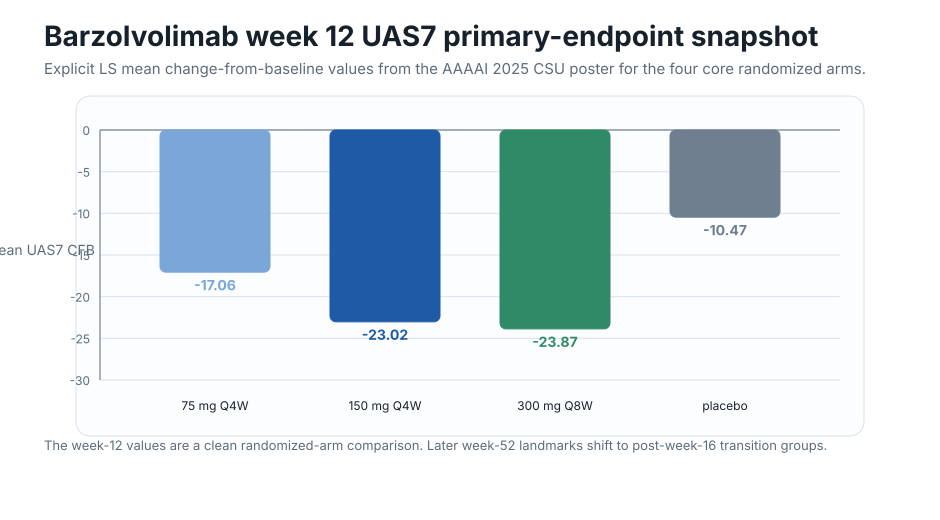
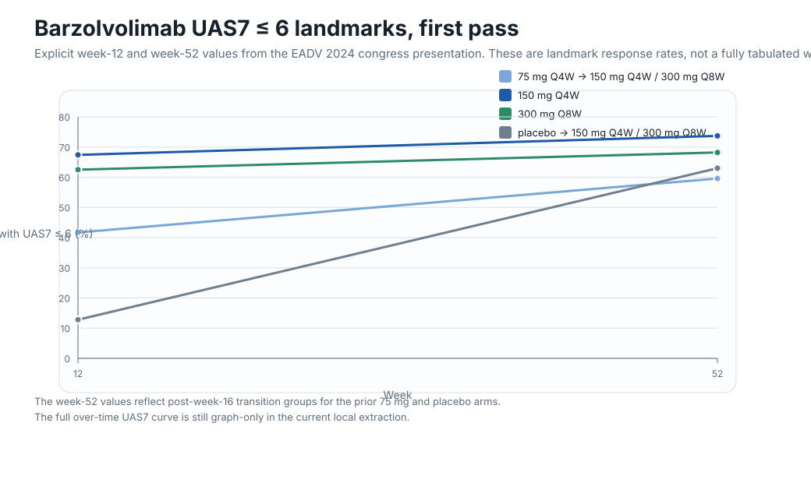
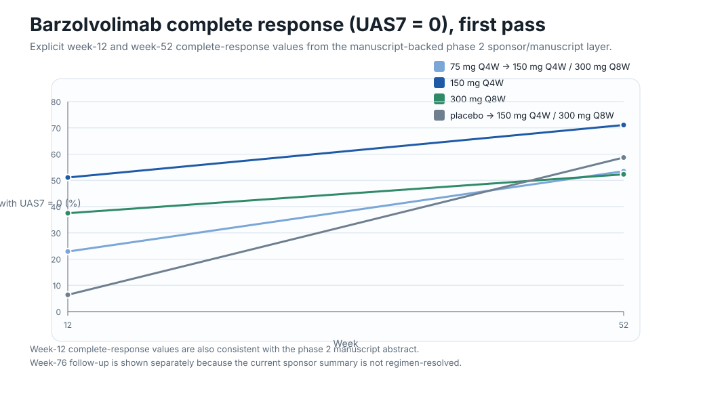
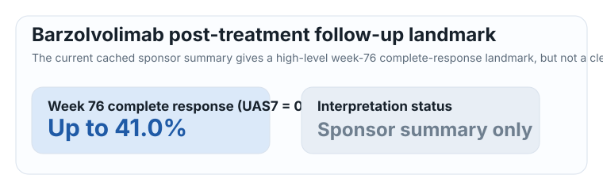

# Barzolvolimab longitudinal UAS7

This is the first plotted pass from the barzolvolimab sponsor-poster and manuscript layer.

## What this page shows

- Only **explicit numeric values** captured from the current local source stack
- No hand-read curve guessing
- A **landmark** view rather than a full weekly curve, because the current local extraction gives clear week 12 and week 52 response landmarks but not a safely tabulated full UAS7 time series
- A separate post-treatment follow-up callout where the sponsor summary gives a usable high-level week 76 numeric landmark

## Plot 1: Week 12 primary-endpoint snapshot

This figure uses explicit **LS mean change-from-baseline in UAS7 at week 12** from the AAAAI 2025 CSU poster.

## Plot 2: UAS7 <= 6 landmarks

This figure uses explicit **week 12 and week 52** responder-rate values from the EADV 2024 congress presentation.

## Plot 3: Complete response (UAS7 = 0) landmarks

This figure uses explicit **week 12 and week 52** complete-response values from the same phase 2 source layer, with week 12 values also cross-supported by the phase 2 manuscript abstract.

## Post-treatment follow-up landmark

The current sponsor-summary layer also gives a usable high-level **week 76** complete-response landmark after treatment completion.

## Current takeaways

- The clearest explicit numeric barzolvolimab UAS7 backbone right now is **landmark-heavy**, not curve-heavy.
- By **week 12**, the 150 mg Q4W and 300 mg Q8W regimens already show much larger UAS7 improvement than placebo on the primary endpoint snapshot.
- By **week 52**, both active maintained-regimen groups and both transitioned groups show strong rates of **UAS7 <= 6** and **UAS7 = 0**, which fits the broader durability story already visible on the sponsor pages.
- The currently cached sponsor follow-up summary extends that story beyond active dosing, with **up to 41%** complete response at **week 76**.

## Current gaps

- Exact **week-by-week mean UAS7** values are still graph-only in the current local extraction.
- Exact regimen-resolved **week 52 mean UAS7 / mean UAS7 CFB** is not yet safely tabulated.
- The week 52 values for the former **75 mg** and **placebo** groups are transition-group landmarks after **week 16 re-randomization**, not unchanged original-arm trajectories.
- The current **week 76** value is a sponsor-summary high-level landmark, not a clean regimen-resolved observed-data table.

## Local evidence files

- Dataset: `data/barzolvolimab_longitudinal_uas7.json`
- Notes: `data/barzolvolimab_longitudinal_uas7_notes.md`
- Source wrappers:
  - `raw/sponsors/kit/barzolvolimab/aaaai-2025-csu-poster.md`
  - `raw/sponsors/kit/barzolvolimab/eadv-2024-congress-presentation.md`
  - `raw/sponsors/kit/barzolvolimab/ir-press-release-additional-positive-data.md`
  - `raw/publications/pubmed/markdown/PMID41747871.md`
