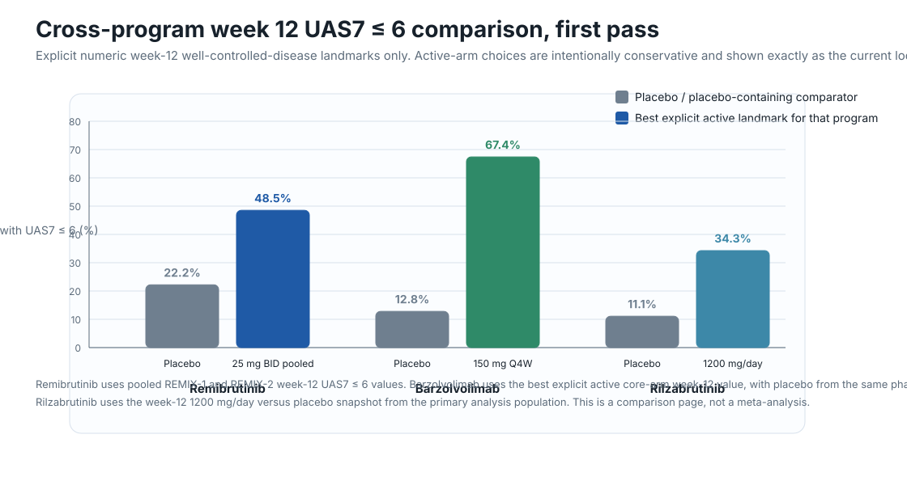

# Cross-program longitudinal UAS7 comparison

This page is the first honest shared comparison layer across the current remibrutinib, barzolvolimab, and rilzabrutinib longitudinal datasets.

## Guardrails
- Only **explicit numeric values** from the current local cache are used here.
- No interpolated weekly points, no hand-digitized curve estimates, and no pseudo-pooled cross-program effect sizes.
- This is a practical comparison page, not a formal indirect treatment comparison or meta-analysis.

## Plot: Week 12 UAS7 <= 6 across programs
This shared plot uses the cleanest current week-12 well-controlled-disease landmark available for each program.

## Shared comparison table

| Program | Explicit early-onset read | Best explicit week-12 controlled-disease landmark | Furthest explicit efficacy landmark in current local layer | Main caveat |
|---|---|---|---|---|
| [Remibrutinib](../programs/remibrutinib.md) | Week 1 UAS7 CFB separation in both REMIX studies, plus pooled week 1 UAS7 <= 6 11.7% vs 0.7% placebo | Pooled week 12 UAS7 <= 6: 48.5% vs 22.2% placebo | Week 52 pooled UAS7 = 0: 35.1%; severe band only 8.1% | Richest current time-series layer, but exact week-52 mean UAS7 and per-trial week-52 UAS7 <= 6 remain graph-only |
| [Barzolvolimab](../programs/barzolvolimab.md) | No comparably clean week 1 numeric onset table yet in the current local cache | Best week 12 UAS7 <= 6: 67.4% (150 mg Q4W) vs 12.8% placebo; week 12 UAS7 = 0 reaches 51.1% in the same arm | Week 52 UAS7 <= 6: 73.7% and week 52 UAS7 = 0: 71.1% in the maintained 150 mg Q4W arm; sponsor-summary follow-up extends to week 76 | Week-52 values for prior 75 mg and placebo groups are transition-group landmarks after re-randomization, not unchanged original-arm trajectories |
| [Rilzabrutinib](../programs/rilzabrutinib.md) | Week 1 high-dose (1200 mg/day) vs placebo UAS7 difference: -7.89 | Week 12 UAS7 <= 6: 34.3% vs 11.1% placebo in the 1200 mg/day arm | Week 12 is still the cleanest mature CSU landmark in the current local layer | Current longitudinal layer is credible but thin: no safely tabulated four-arm weekly curve and no mature week-24/week-52 CSU table yet |

## Practical read
- **Remibrutinib** currently has the strongest explicit early-onset and overall time-series backbone.
- **Barzolvolimab** currently has the strongest explicit week-12 and durability responder landmarks, but the later transition-group structure needs to stay visible in the interpretation.
- **Rilzabrutinib** has a real signal and a usable week-12 comparison layer, but it is still materially thinner than the remibrutinib and barzolvolimab longitudinal stacks.

## Program-specific pages
- [Remibrutinib longitudinal UAS7](../queries/remibrutinib-longitudinal-uas7.md)
- [Barzolvolimab longitudinal UAS7](../queries/barzolvolimab-longitudinal-uas7.md)
- [Rilzabrutinib longitudinal UAS7](../queries/rilzabrutinib-longitudinal-uas7.md)
