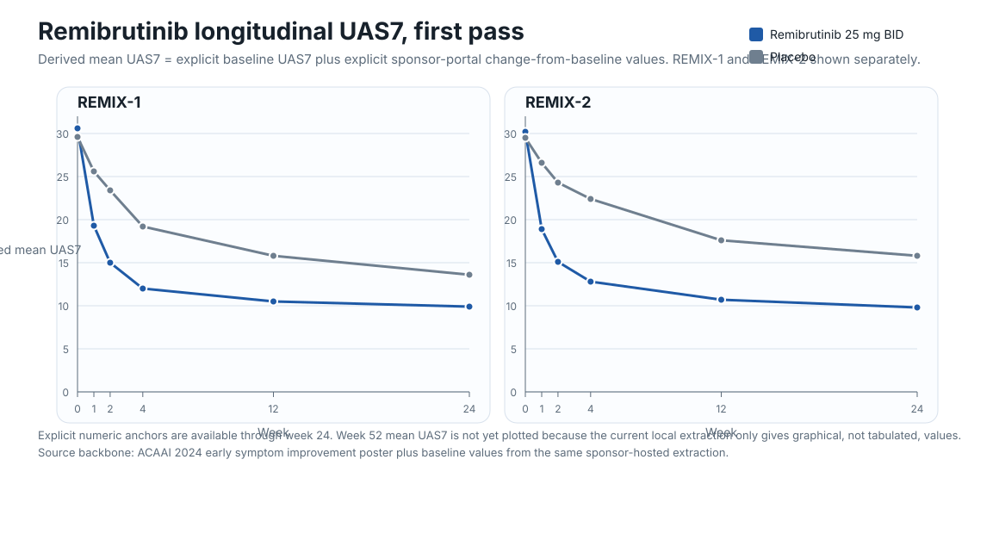
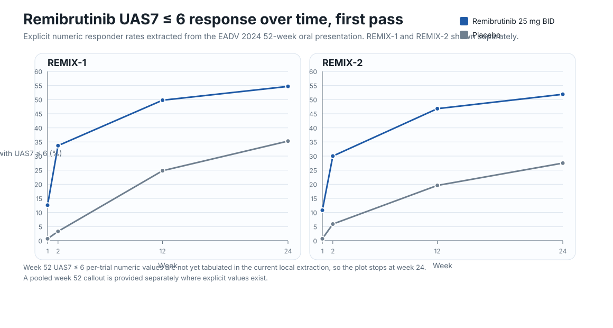
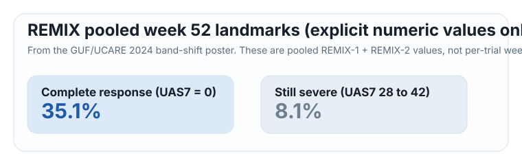

# Remibrutinib longitudinal UAS7

This is the first plotted pass from the remibrutinib sponsor-portal extraction layer.

## What this page shows

- Only **explicit numeric values** captured from the current local source stack
- No hand-read curve guessing
- REMIX-1 and REMIX-2 shown separately where the source allowed it
- Week 52 is currently shown only where explicit pooled values were available

## Plot 1: Derived mean UAS7 over time

This figure uses explicit baseline UAS7 values plus explicit change-from-baseline values extracted from the ACAAI 2024 early symptom improvement poster.

## Plot 2: UAS7 ≤ 6 response over time

This figure uses explicit responder-rate values extracted from the EADV 2024 52-week oral presentation.

## Week 52 pooled landmarks

This pooled week 52 callout comes from the GUF/UCARE 2024 band-shift poster.

## Current takeaways

- Remibrutinib separates from placebo **very early**, with visible UAS7 improvement by **week 1** in both REMIX studies.
- The main explicit numeric sponsor-portal backbone now covers **weeks 0, 1, 2, 4, 12, and 24** for UAS7 trajectory.
- By the current pooled week 52 landmark layer, **35.1%** of remibrutinib-treated patients reached **UAS7 = 0**, while only **8.1%** remained in the severe UAS7 band.

## Current gaps

- Exact **week 52 mean UAS7 change-from-baseline** is not yet plotted because it is still graphical in the current local extraction.
- Exact per-trial **week 52 UAS7 ≤ 6** values are not yet extracted numerically.
- Placebo-to-remibrutinib switch-arm trajectory is still present mainly as figure content rather than clean tabulated points.

## Local evidence files

- Dataset: `data/remibrutinib_longitudinal_uas7.json`
- Notes: `data/remibrutinib_longitudinal_uas7_notes.md`
- Source wrappers:
  - `raw/sponsors/btk/remibrutinib/acaai-2024-early-symptom-improvement-poster.md`
  - `raw/sponsors/btk/remibrutinib/eadv-2024-early-and-long-term-efficacy-oral.md`
  - `raw/sponsors/btk/remibrutinib/guf-2024-disease-activity-band-shift-52wk-poster.md`
