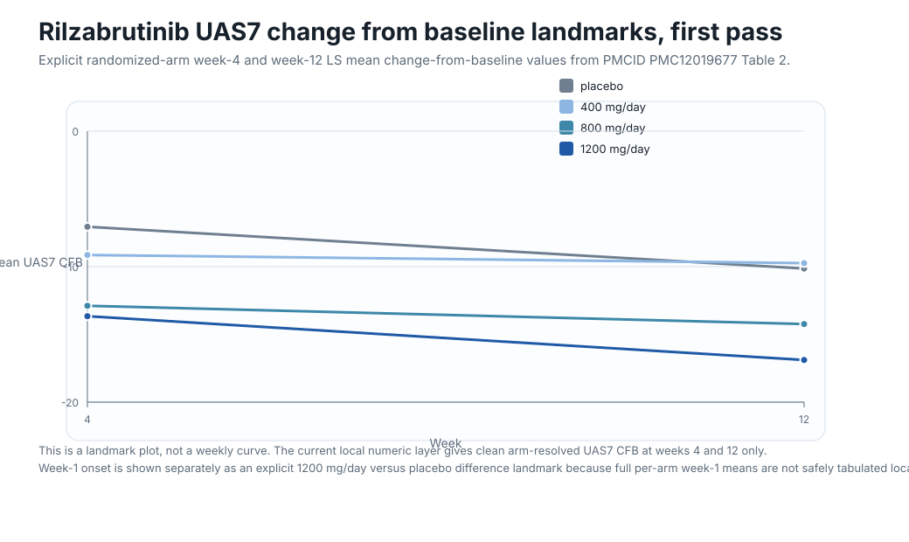
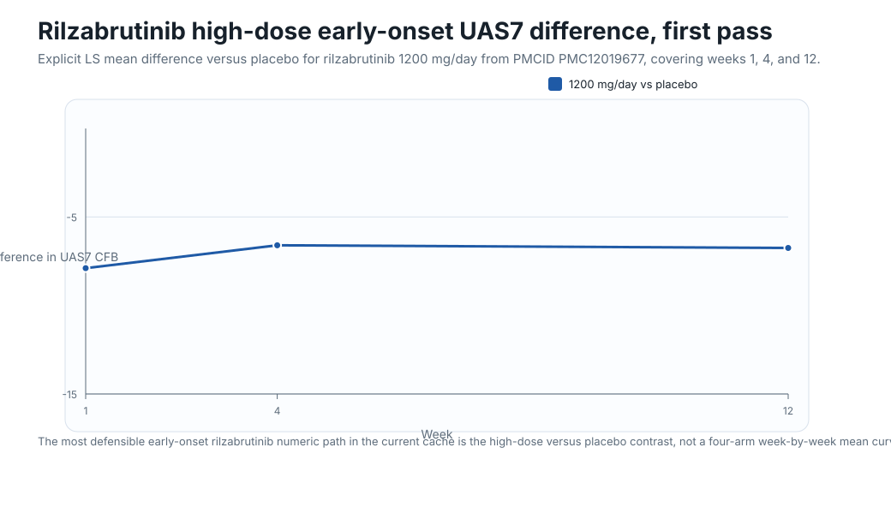
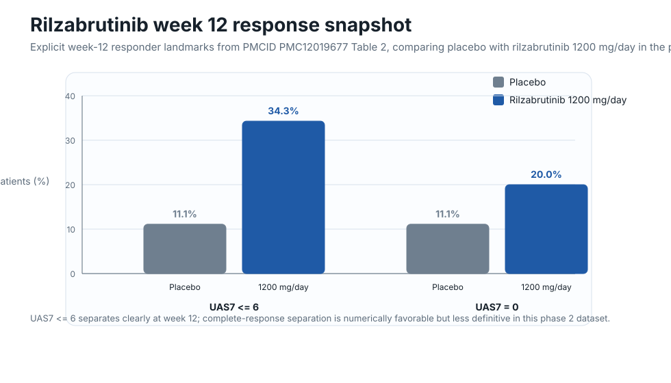

# Rilzabrutinib longitudinal UAS7

This is the first plotted rilzabrutinib pass from the current local manuscript and sponsor-poster layer.

## What this page shows

- Only **explicit numeric values** from the current local source stack
- No hand-digitized weekly curve guessing
- A **landmark** view rather than a full weekly curve, because the current local extraction supports clean week 4 and week 12 arm-resolved UAS7 values, plus a week 1 high-dose onset contrast, but not a safely tabulated full four-arm week-by-week time series
- Week 12 responder snapshots so the signal is not reduced to mean-score change alone

## Plot 1: UAS7 change-from-baseline landmarks by arm

This figure uses explicit randomized-arm **LS mean UAS7 change-from-baseline** values at **week 4** and **week 12** from `PMC12019677` Table 2.

## Plot 2: Early high-dose onset signal versus placebo

This figure uses explicit **1200 mg/day versus placebo** UAS7 difference landmarks at **week 1**, **week 4**, and **week 12** from the same manuscript layer.

## Plot 3: Week 12 responder snapshot

This figure uses explicit **week 12** `UAS7 <= 6` and `UAS7 = 0` values for **placebo** and **rilzabrutinib 1200 mg/day** from `PMC12019677` Table 2.

## Current takeaways

- The usable rilzabrutinib CSU longitudinal layer is currently **real but thinner** than the remibrutinib and barzolvolimab layers.
- The cleanest arm-resolved UAS7 backbone right now is **week 4 plus week 12**, with a visible dose-response pattern and the strongest separation in the **1200 mg/day** arm.
- The manuscript clearly supports a **rapid high-dose onset signal by week 1**, but only as a **between-arm difference landmark**, not as a full four-arm week-1 table.
- By **week 12**, the high-dose arm shows a more meaningful **well-controlled disease** signal than placebo, while **complete response** is numerically favorable but less decisive.

## Current gaps

- No safely tabulated **four-arm week-by-week UAS7 curve** is available in the current local cache.
- The current local layer does **not** yet provide a mature **week 24 or week 52 CSU efficacy table** suitable for direct longitudinal comparison with the richer remibrutinib or barzolvolimab layers.
- Baseline UAS7 means are available, but they come from the randomized population while the plotted efficacy landmarks use the primary analysis population, so they are being treated as context rather than used to fabricate a pseudo-continuous mean-UAS7 trajectory.

## Local evidence files

- Dataset: `data/rilzabrutinib_longitudinal_uas7.json`
- Notes: `data/rilzabrutinib_longitudinal_uas7_notes.md`
- Source wrappers:
  - `raw/publications/pmc/markdown/PMC12019677.md`
  - `raw/publications/pmc/xml/PMC12019677.xml`
  - `raw/publications/pubmed/markdown/PMID40266575.md`
  - `raw/sponsors/btk/rilzabrutinib/rilecsu-phase-2-hives-poster.md`
  - `raw/sponsors/btk/rilzabrutinib/phase-2-csu-results-press-release.md`
